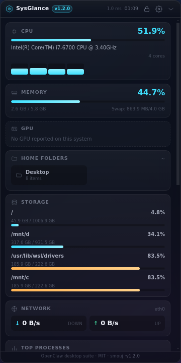
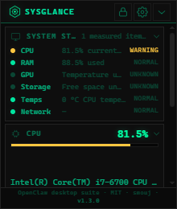

<p align="center">
  
</p>

<h1 align="center">SysGlance</h1>

<p align="center">
  <strong>On-demand desktop control center — real system metrics and Windows shell configuration, in one overlay</strong>
</p>

<p align="center">
  
  
  
  
  
</p>

<p align="center">
  
  &nbsp;&nbsp;
  
</p>
<p align="center">
  <sub>Sidebar (default) and the Mini widget · also: <a href="docs/screenshot-dock.png">Dock</a> · <a href="docs/screenshot-settings.png">Settings</a></sub>
</p>

---

## ✨ What is SysGlance?

SysGlance is a semi-transparent desktop overlay that floats on top of your
windows — like a sci-fi HUD — showing real-time CPU, memory, GPU, network, disk,
temperature, processes, and **filesystem folders** you can click to open. On
Windows it also **configures the shell** it sits on: taskbar position, auto-hide,
dark mode, accent colour and wallpaper.

It is the *on-demand* half of a two-app desktop suite. Its sibling,
[OpenClaw Widget](https://github.com/smouj/openclaw-desktop-widget), is the
always-resident glance; SysGlance is what you open when you want depth. See
[`PRODUCT.md`](PRODUCT.md) for the split, which is enforced in code — not just in
prose.

Runs in the **system tray** as a background process. Close the window → it hides
to tray. `Ctrl+Shift+S` toggles it. Everything is configurable from the built-in
**⚙️ Settings Panel**.

## 🖥️ Features

### Monitoring
- **CPU** — per-core load, temperature, speed, model
- **Memory** — usage, swap, formatted readout
- **GPU** — model, utilization, VRAM, temperature
- **Disks** — multi-volume usage with colour-coded bars
- **Network** — live download/upload per interface, session totals and peak rates
- **Processes** — top 8 by CPU with PID, RAM, local filtering, copy-PID/path, open-location and confirmed end-task actions
- **Battery** — percentage and charging state (laptops only)
- **System Status** — objective CPU, RAM, GPU temperature, storage and network status rows; no scareware scores
- **Local history** — bounded CPU/RAM/GPU/temperature/network ring buffers with selectable 1m/5m/30m/1h/6h/24h sparklines and a 24-hour retention ceiling
- **Local alerts** — threshold + duration + cooldown + recovery for sustained load, temperature, RAM, disk and process conditions; active alerts appear in System status without contacting a server
- **Filesystem** — Desktop, Documents, Downloads, Pictures, Videos, Music as real
  tiles: item counts, a hover/focus affordance, Enter/Space activation, and a
  status message when a folder cannot be opened
- **Hardware inspector** — on-demand CPU/OS identity, BIOS/baseboard, memory
  modules, storage devices, graphics, adapters and display topology; sensitive
  serial, MAC and IP fields are excluded from the exported summary

### Windows shell configuration
- **Taskbar position** — left / top / right / bottom (`StuckRects3`, exactly one
  byte edited and the rest of the blob written back verbatim), shown as a
  **miniature desktop with the bar drawn on the selected edge**
- **Auto-hide** — one bit of one byte; the other sticky-rect flags are preserved
- **Dark / light mode**, **accent derived from the wallpaper** (hex and swatch
  shown), **custom accent colour picker** (native colour input, hex field, 16
  presets), **wallpaper application** with a **thumbnail of the current wallpaper**
- **Wallpaper gallery** — browse images from `Pictures\Wallpaper`, preview
  thumbnails, apply with one click. Animated wallpapers (.webm/.mp4) are
  detected; SysGlance opens the folder since Windows has no native animated
  wallpaper API
- **Start menu** — toggle recent apps, suggestions, and full-screen Start;
  button to open `ms-settings:personalization`
- **Folder icons** — customize icons for Desktop, Documents, Downloads,
  Pictures, Videos, Music via `desktop.ini`; restore defaults
- **Desktop preview** — the current wallpaper as a miniature background with
  the taskbar bar on the selected edge
- Taskbar *vibrancy* is deliberately **not** here — that resident effect belongs
  to OpenClaw Widget. The panel says so and links to it.
- Nothing is applied behind your back: changing position or auto-hide asks for an
  explorer restart and offers the button; it never restarts on its own.

### Layout modes
| Mode | Description |
|---|---|
| **Sidebar** | Default vertical panel — full detail, scrollable |
| **Dock** | Horizontal bar — compact, wide, sits at the bottom |
| **Corner** | Mini widget — ultra-compact, essentials only |

### Settings panel
Layout · position · theme · opacity (30–100%) · **fast refresh (0.5–5 s)** ·
**hardware refresh (5–10 s)** · per-section toggles · lock/drag mode ·
compact mode · configurable toggle/lock/palette shortcuts. Every value is
persisted, validated and clamped; reduced-motion and forced-colour preferences
are respected by the UI.

Desktop profiles are local and versioned: save, apply, duplicate, rename,
delete, import and export. Normal Apply changes the SysGlance layout,
monitoring configuration and selected display. A separate **Apply shell
settings** action asks for confirmation and applies taskbar/theme/accent/
wallpaper as one rollback-capable transaction; it never changes the registry
silently. The display selector tracks each monitor's work area, scale factor
and hot-plug lifecycle.

The command palette is a small in-app control center: it navigates health,
metrics, processes and profiles, and can open the allow-listed Windows Settings,
network, display, apps, Task Manager and Windows Services surfaces, lock the PC,
or request sleep and restart with confirmation. It is intentionally not a
general launcher.

The settings panel also provides a sanitized system summary for clipboard copy,
JSON export, a ZIP support bundle and an explicit Open logs action. It excludes
document contents, serials and network addresses, redacts saved paths and
includes only a bounded recent-log tail. Direct shell changes have a bounded
local undo journal; profile shell application is a separate confirmed
transaction with the same rollback journal.

### Performance, measured
The hot path uses **Node's own `os` module in process** — no `wmic`, no
`powershell`, no `df`, no child process at all. `systeminformation` is reserved
for what Node cannot read (GPU, temperatures, disks, network counters,
processes, battery) and runs on a slower, configurable cadence.

Measured with `npm run bench` on the same Windows host; the fast-cycle figure is the latest three-iteration sample and the steady-state comparison is the recorded follow-up run:

| | before | after |
|---|---|---|
| cost of one fast cycle | ~47 ms | **0.82 ms** |
| child processes per fast cycle | ~12.5 | **0** |
| steady state, per second of uptime | 31.1 ms / 8.3 spawns | **11.8 ms / 2.9 spawns** |

The status bar shows the measured cost of the last cycle (`⏱ 0.8 ms`), so the
number above is verifiable in the app rather than taken on faith.

## 📦 Install

### Installer (Windows)
Download `SysGlance-Setup-x.y.z.exe` from the releases page and run it. The
installer is a normal NSIS package: per-user by default, no elevation
(`asInvoker`), with Start Menu and desktop shortcuts.

### From source
```bash
git clone https://github.com/smouj/sysglance.git
cd sysglance
npm ci
npm start
```
Node 20 or newer. There are no native npm modules and no build step.

> On Linux, Electron needs a display. For a headless machine or CI:
> `xvfb-run -a npm start`

### Installing without an installer (per-user, no admin)

Two environment facts that bite when you build for Windows:

- **On Windows**, electron-builder unpacks `winCodeSign` into its cache and that
  archive contains macOS symlinks. Without elevation it fails with
  `Cannot create symbolic link : ... no dispone de un privilegio requerido`.
  Fix: enable **Developer Mode** (Settings → Privacy & security → For
  developers) or build from an elevated shell.
- **On Linux/macOS**, Windows targets need a 32-bit-capable Wine, because
  `rcedit` is a 32-bit binary.

If you only need the app for the current user, skip NSIS entirely and install the
unpacked build:

```powershell
npm run build:win -- --dir      # or: npx electron-builder --win dir
powershell -File scripts\install-user.ps1
```

`scripts/install-user.ps1` copies the build to
`%LOCALAPPDATA%\Programs\SysGlance`, creates the Start-menu and desktop
shortcuts, registers it in *Apps & features* with its own uninstaller
(`scripts\uninstall-user.ps1`) and launches it.

### Build it yourself
```bash
npm run build:win      # -> dist/SysGlance-Setup-1.2.0.exe   (NSIS)
npm run build:linux    # -> dist/SysGlance-1.2.0-x64.AppImage + .deb
npm run build:mac      # -> dist/*.dmg
```

On Windows, build the one-shot shell helper before packaging:

```powershell
powershell -ExecutionPolicy Bypass -File scripts\build-native.ps1
```

The Windows CI job performs this step automatically.
Building Windows targets from Linux/macOS requires a **32-bit-capable** Wine:
electron-builder runs `rcedit-ia32.exe` to stamp the installer's icon and
version resources, and that is a 32-bit binary. A wine64-only install gets as
far as packaging `dist/win-unpacked/SysGlance.exe` and then fails with
`wine: failed to load ... syswow64\ntdll.dll`. The prerequisite is:

```bash
sudo dpkg --add-architecture i386 && sudo apt-get update
sudo apt-get install wine32:i386
```

CI does not need any of this: `.github/workflows/ci.yml` builds the NSIS
installer on `windows-latest`.

## 🛠️ Development

```bash
npm start              # run the app
npm run self-test      # boot, read metrics, assert the IPC bridge, exit non-zero on error
npm run verify         # syntax + settings validation + shell harness
npm run bench          # before/after refresh-cycle benchmark
```

| Gate | Command | Covers |
|---|---|---|
| Syntax | `npm run verify:syntax` | `node --check` on every JS file in `src/` and `scripts/` |
| Settings | `npm run verify:config` | defaults, clamping, enums, hostile input, atomic persistence |
| Shell | `npm run verify:shell` | live Windows state, byte-precise registry math, accent math |
| Privacy | `npm run verify:privacy` | no outbound/telemetry primitives, vendor SDKs or unnecessary direct runtime dependencies |
| End to end | `npm run self-test` | real window, real metrics, `window.sysglance` present, version rendered |

The shell harness is read-only; its only write is a scratch registry key it
deletes in the same run. It never moves the taskbar and never restarts explorer.

## 🔐 Security model

The renderer is untrusted UI code:

```js
webPreferences: {
  contextIsolation: true,
  nodeIntegration: false,
  sandbox: true
}
```

`src/preload.js` exposes a narrow `window.sysglance` through `contextBridge` —
one named wrapper per channel, no generic `invoke`/`send` escape hatch, and an
allow-list for event subscriptions. Every argument is validated again in the
main process (`src/config.js` for settings, explicit checks for paths), and the
renderer can only ask to open the home folders the app offers — not any
directory it names.
The CSP allows no inline script and no network access from the page.
Details: [`docs/IPC-SECURITY.md`](docs/IPC-SECURITY.md).

The audit and measured baselines live in [`docs/COMMERCIAL_BASELINE.md`](docs/COMMERCIAL_BASELINE.md) and [`docs/PERFORMANCE_BASELINE.md`](docs/PERFORMANCE_BASELINE.md). The metric, alert and release boundaries are documented in [`docs/METRIC_ENGINE.md`](docs/METRIC_ENGINE.md), [`docs/ALERTS.md`](docs/ALERTS.md) and [`docs/RELEASE.md`](docs/RELEASE.md).

## 📁 Project structure

```
sysglance/
├── src/
│   ├── main.js            # Electron main — window, tray, IPC, metrics loop, self-test
│   ├── preload.js         # contextBridge surface (the only renderer↔main path)
│   ├── renderer.js        # UI logic, settings panel, rAF-batched rendering
│   ├── config.js          # defaults, validation, atomic persistence
│   ├── log.js             # console + rotating file log
│   ├── metrics.js         # fast (node:os) / slow (systeminformation) / static tiers
│   ├── index.html         # overlay layout + settings panel
│   ├── styles.css         # glass/HUD theme, 3 layout modes
│   ├── shell/             # Windows shell configuration
│   │   ├── taskbar.js     #   registry byte math, theme, accent, wallpaper
│   │   ├── ipc.js         #   the shell:* channel surface
│   │   ├── panel.js       #   renderer-side panel (self-contained DOM)
│   │   └── panel.css
│   └── native/
│       ├── shellHelper.js          # controller for the one native binary
│       └── shell/SysGlanceShellHelper.cs   # wallpaper + theme broadcast (one-shot)
├── scripts/
│   ├── verify-syntax.js         # node --check gate
│   ├── verify-config.js         # settings validation harness
│   ├── verify-shell.js          # registry/accent harness (read-only)
│   ├── verify-shell-extended.js # wallpaper gallery, folders, start menu, accent hex
│   ├── bench-metrics.js         # before/after refresh-cycle benchmark
│   ├── build-native.ps1         # compiles the C# helper with in-box csc.exe
│   └── verify-accent-pixels.ps1      # independent accent-sampler cross-check
├── assets/                # logo, icons
├── docs/                  # screenshot, SHELL.md, IPC-SECURITY.md
├── CONTRIBUTING.md
├── CHANGELOG.md
├── PRODUCT.md             # the split with OpenClaw Widget (tie-breaker)
└── LICENSE                # MIT
```

## ⌨️ Shortcuts

| Shortcut | Action |
|---|---|
| `Ctrl+Shift+S` | Show / hide overlay |
| `Ctrl+Shift+L` | Lock / unlock position (click-through ↔ draggable) |
| `⚙️` button | Settings panel |
| Right-click | Context menu (layout, position, theme, shell) |
| Tray double-click | Show / hide |
| Folder click | Open in the file manager |

## 🧰 Tech stack

| Technology | Purpose |
|---|---|
| **Electron 44** | Desktop runtime |
| **Node `os` / `/proc`** | Fast metrics tier — in-process, zero spawns |
| **systeminformation** | Hardware tier only (GPU, temps, disks, network, processes, battery) |
| **Vanilla JS + CSS** | Zero framework overhead; `backdrop-filter` for the glass |
| **reg.exe via `execFile`** | Windows shell configuration (taskbar, theme, accent, Start menu), argument-array invocation only |
| **In-box `csc.exe`** | The one native helper (wallpaper / theme broadcast) |
| **`desktop.ini` + `attrib`** | Folder icon customization (IconResource) |

## 🤝 Contributing

See [`CONTRIBUTING.md`](CONTRIBUTING.md). The short version: run `npm run verify`
before you push, keep the fast tier free of child processes, and do not give
SysGlance a resident taskbar effect.

## 📄 License

[MIT](LICENSE) — use it, modify it, share it.

---

<div align="center">

**OpenClaw desktop suite** — two desktop apps, one suite.

[OpenClaw Widget](https://github.com/smouj/openclaw-desktop-widget) · [SysGlance](https://github.com/smouj/sysglance)

MIT License · Made by [smouj](https://github.com/smouj)

<sub>No server · No telemetry · No subscriptions</sub>

</div>

## Themes

SysGlance ships with three built-in themes:

| Theme | Description |
|-------|-------------|
| **Dark** | Semi-transparent glass overlay with blur, accent cyan, and depth shadows. The default. |
| **Light** | Opaque light surface with blue accents, designed for light desktop backgrounds. |
| **LCD** | Retro monochrome LCD display aesthetic — sharp borders, monospace font, phosphor green (#00ffa3) text with glow, block-style progress bars with stepped animation, and a scanning line effect on the desktop preview. Inspired by the Logitech G510 LCD. |

Switch themes from:
- Settings panel → Appearance
- Tray icon → Theme submenu
- Context menu → Theme submenu

The LCD theme disables blur, removes all border-radius, uses `steps(4)` animation for progress bars, and adds a subtle phosphor `text-shadow` glow on key values.
